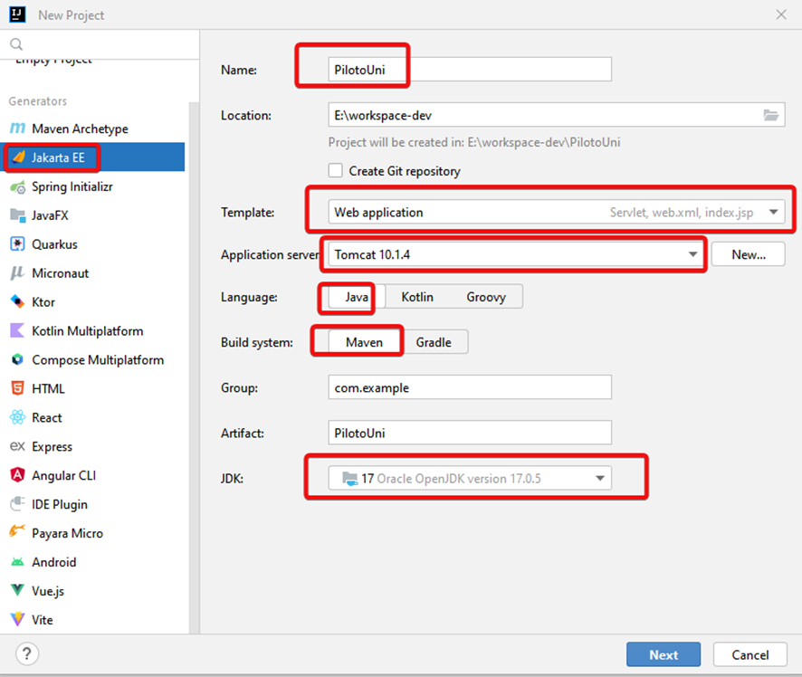
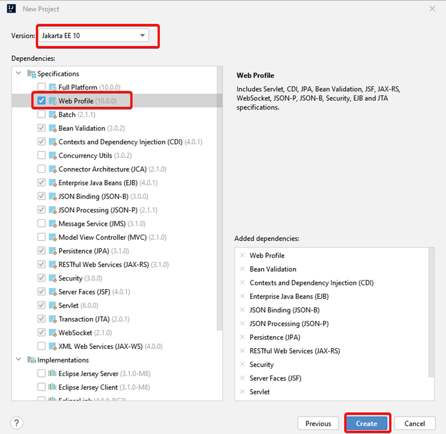
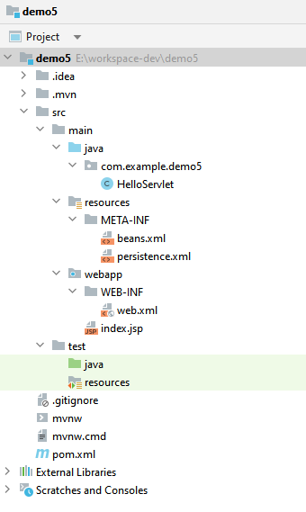
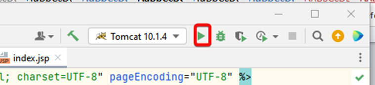
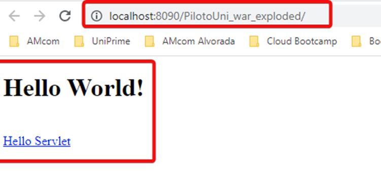
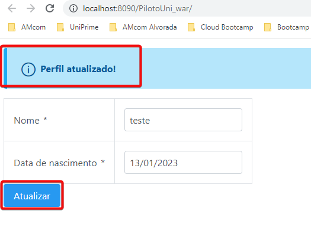
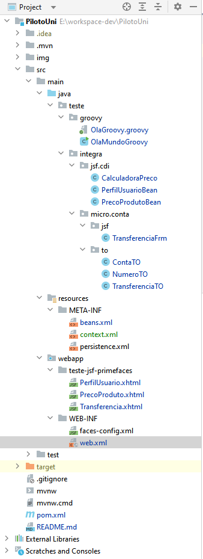

# Objetivo
Criar e configurar um projeto Jakarta EE 10 no Intellij 2022.3 e executar no Tomcat 10.1.4 utilizando as tecnologias da Stack abaixo.

# Stack
- JDK 17.0.5
- Intellij 2022.3
- Maven 3.6.3
- Tomcat Server 10.1.4
- Jakarta Web API EE 10
- Spring 5.3.22
- Junit 5.9.1
- PrimeFaces 12.0.0
- Jakarta Faces 3.0.3
- Jackson Databind 2.9.9
- Lombok 1.18.24
- Groovy 4.0.1
- Weld CDI Servlet Shaded 5.0.1


# Pré-requisitos
O JDK 17.0.5, Intellij 2022.3, Maven 3.6.3 e Tomcat Server 10.1.4 devem já estar instalados previamente.

Link para download do Tomcat 10.1.4 ( .zip)
Link: https://archive.apache.org/dist/tomcat/tomcat-10/v10.1.4/src/

# 1. Criando o projeto Jakarta EE 10 no intellij
Em New >  **Project..**  
Selecionar **Jakarta EE**  

Na tela de criação do projeto Informar:   

**Nome:** Nome do projeto  
**Location:** Workspace de trabalho  
**Template:**  Selecionar **WebApplication** que ira gerar um projeto WEB configurando o  Servlet e gerando os arquivos: web.xml e index.jsp.    
**Servidor de aplicação:** Tomcat 10.1.4 (o tomcat já deve estar instalado, e configurado no intellij)  
**Linguagem:** Java  
**Build System:** Maven  
**Group:** com.example (exemplo)  
**Artifact:** Assume o mesmo nome do projeto (opcional pode ser alterado)  
**JDK:** 17  



Clicar em **Next**

# 2. Informando versão do Jakarta  
Na próxima tela informar:    
Selecionar em Version:  **Jakarta EE 10**  
e  em Dependencies: **Web Profile**    
**Nota:** Ao selecionar ***WebProfile*** para criação de um projeto Jakarta EE WEB, todas as dependências básicas necessárias serão  
incluídas no  arquivo pom.xml do projeto, através da dependência **jakarta.platform**,  com exceção do Junit, que também terá sua dependência incluida no pom.xml.
  
Clicar em **Create.**

# 3. Estrutura do projeto gerada   
Ao clicar em **Create** o Intellij ira criar um projeto com seguinte estrutura de pastas abaixo:  
   

# 4. Executando o projeto no Tomcat    
Executar o projeto no Tomcat   
  

  
<br/>

Após a execução do Tomcat a  seguinte tela será exibida, sinalizando que o projeto foi criado com sucesso.  
  

# 5. Atualizando o projeto 
Para atualizar o projeto com a Stack desejada, o pom.xml deve ser alterado com novas dependências e o projeto 
configurado para integração com o Tomcat, JSF e CDI.

## 5.1 Alterando o pom.xml
Excluir a tag <properties> do pom.xml e incluir as novas tags <properties> abaixo, com as versões das dependências desejadas:  

```
<properties>
    <project.build.sourceEncoding>UTF-8</project.build.sourceEncoding>  
    <maven.compiler.target>11</maven.compiler.target>  
    <maven.compiler.source>11</maven.compiler.source>  
    <jakarta.platform.version>10.0.0</jakarta.platform.version>  
    <springframework.version>5.3.22</springframework.version>  
    <jackson-databind.version>2.9.9</jackson-databind.version>  
    <jakarta.faces.version>3.0.3</jakarta.faces.version>  
    <primefaces.version>12.0.0</primefaces.version>  
    <all-themes.version>1.0.10</all-themes.version>  
    <jakarta.cdi.version>4.0.1</jakarta.cdi.version>  
    <junit.version>5.9.1</junit.version>  
    <lombok.version>1.18.24</lombok.version>  
    <groovy.version>4.0.1</groovy.version>  
    <wel-servlet.version>5.1.0.Final</wel-servlet.version>  
 </properties>    
```  

Excluir as dependências do pom.xml e incluir as novas dependências abaixo:  

```
 <dependency>
            <groupId>jakarta.platform</groupId>
            <artifactId>jakarta.jakartaee-web-api</artifactId>
            <version>${jakarta.platform.version}</version>
            <scope>provided</scope>
        </dependency>
        <!-- Spring framework -->
        <dependency>
            <groupId>org.springframework</groupId>
            <artifactId>spring-web</artifactId>
            <version>${springframework.version}</version>
        </dependency>

        <!-- jackson json -->
        <dependency>
            <groupId>com.fasterxml.jackson.core</groupId>
            <artifactId>jackson-databind</artifactId>
            <version>${jackson-databind.version}</version>
        </dependency>
        <!-- JSF -->
        <dependency>
            <groupId>org.glassfish</groupId>
            <artifactId>jakarta.faces</artifactId>
            <version>${jakarta.faces.version}</version>
        </dependency>
        <!-- Primefaces -->
        <dependency>
            <groupId>org.primefaces</groupId>
            <artifactId>primefaces</artifactId>
            <version>${primefaces.version}</version>
            <classifier>jakarta</classifier>
        </dependency>
        <dependency>
            <groupId>org.primefaces.themes</groupId>
            <artifactId>all-themes</artifactId>
            <version>${all-themes.version}</version>
        </dependency>
        <!-- CDI -->
     <dependency>
            <groupId>jakarta.enterprise</groupId>
            <artifactId>jakarta.enterprise.cdi-api</artifactId>
            <version>${jakarta.cdi.version}</version>
        </dependency>
        <dependency>
            <groupId>org.projectlombok</groupId>
            <artifactId>lombok</artifactId>
            <version>${lombok.version}</version>
            <scope>provided</scope>
        </dependency>
        <!-- Groovy -->
        <dependency>
            <groupId>org.apache.groovy</groupId>
            <artifactId>groovy</artifactId>
            <version>${groovy.version}</version>
        </dependency>
        <dependency>
            <groupId>org.jboss.weld.servlet</groupId>
            <artifactId>weld-servlet-shaded</artifactId>
            <version>${wel-servlet.version}</version>
        </dependency>

        <dependency>
            <groupId>org.junit.jupiter</groupId>
            <artifactId>junit-jupiter-api</artifactId>
            <version>${junit.version}</version>
            <scope>test</scope>
        </dependency>
        <dependency>
            <groupId>org.junit.jupiter</groupId>
            <artifactId>junit-jupiter-engine</artifactId>
            <version>${junit.version}</version>
            <scope>test</scope>
        </dependency>
```
## Configurações 
1. Configurando integração dos Beans CDI com Tomcat      
Criar na pasta ***src/main/resources/META-INF*** o arquivo ***context.xml*** com o conteúdo abaixo:  
```
   <Context>
     <Resource name="BeanManager"
      auth="Container"
      type="jakarta.enterprise.inject.spi.BeanManager"
      factory="org.jboss.weld.resources.ManagerObjectFactory"/>
   </Context>
```
  
3. Configurando integração com JSF
**Alterar** o arquivo ```web.xml``` o codigo abaixo:
```
<!-- JSF -->
    <servlet>
        <servlet-name>Faces Servlet</servlet-name>
        <servlet-class>jakarta.faces.webapp.FacesServlet</servlet-class>
        <load-on-startup>1</load-on-startup>
    </servlet>
    <servlet-mapping>
        <servlet-name>Faces Servlet</servlet-name>
        <url-pattern>*.xhtml</url-pattern>
    </servlet-mapping>
```  

4. Configurando a aplicação para utilizar JSF    
**Criar** na pasta ***webapp/WEB-INF*** arquivo **faces-config.xml*** com o conteúdo abaixo:
```
<?xml version='1.0' encoding='UTF-8'?>
 <faces-config version="4.0" xmlns="https://jakarta.ee/xml/ns/jakartaee"
  xmlns:xsi="http://www.w3.org/2001/XMLSchema-instance"
  xsi:schemaLocation="https://jakarta.ee/xml/ns/jakartaee
  https://jakarta.ee/xml/ns/jakartaee/web-facesconfig_4_0.xsd" >

</faces-config>
```

**Inserir** no arquivo ```web.xml``` as configuração do Weld CDI e JNDI para o Tomcat, inserir o conteúdo abaixo:   
```
<!-- configuração Weld CDI -->
<listener>
<listener-class>org.jboss.weld.environment.servlet.Listener</listener-class>
</listener>

    <!--Bind BeanManager ao JNDI in Deployment Tomcat -->
    <resource-env-ref>
        <resource-env-ref-name>BeanManager</resource-env-ref-name>
        <resource-env-ref-type>
            jakarta.enterprise.inject.spi.BeanManager
        </resource-env-ref-type>
    </resource-env-ref>
```

**Alterar** o arquivo ***beans.xml*** para descoberta automática dos Beans CDI, incluindo na tag ***<beans>*** as propriedades abaixo:  
```
version="4.0"
bean-discovery-mode="all">
```  

Exemplo final do arquivo:
```
<?xml version="1.0" encoding="UTF-8"?>
<beans xmlns="https://jakarta.ee/xml/ns/jakartaee"
       xmlns:xsi="http://www.w3.org/2001/XMLSchema-instance"
       xsi:schemaLocation="https://jakarta.ee/xml/ns/jakartaee https://jakarta.ee/xml/ns/jakartaee/beans_4_0.xsd"
       version="4.0"
       bean-discovery-mode="all">

</beans>
```


# Testando as configurações

- Para os testes de front-end com primefaces foi criada a pasta ***teste-jsf-primefaces***, com três arquivos **.xhtml**:     
```PerfilUsuario.xhtml``` - Para testes do Primefaces  
```PrecoProduto.xhtml``` - Para testes do CDI   
```Transferencia.xhtml``` - Para teste de integração da aplicação com microservico.  

**Nota:** Para teste de integração com microserviço essa aplicação deve rodar na porta 8090 e a aplicação ```micro3``` deve ser executada na porta 8080.  
Link pra o projeto do microservico:  https://github.com/Udinei/micro3


- Na pasta ***src/main/java/*** foram criadas três pacotes:  
```groovy``` - Contém as classes para testes de execução do Groovy.     
```integra.jsf.cdi``` - Contém todos os manageBeas para realizar os testes básicos de execução do projeto e integração entre as páginas ```.xhtml``` e os managebeans.  
```micro.conta``` - Contém o TO e managedBeans de testes da integração do adaptador JSF com microservico e as libs do springframework.    

## 1. PrimeFaces
1.1 Inserir o conteúdo abaixo, no arquivo ```web.xml```, que altera a abertura da página inicial para a pagina ```PerfilUsuari.xhtml```  
```
  <welcome-file-list>
        <welcome-file>teste-jsf-primefaces/PerfilUsuario.xhtml</welcome-file>
    </welcome-file-list>
```

1.2 Criar o arquivo **PerfiUsuario.xhtml** na pasta ***webapp*** com o conteúdo abaixo:    
```
<?xml version="1.0" encoding="UTF-8" ?>
<!DOCTYPE html PUBLIC "-//W3C//DTD XHTML 1.0 Transitional//EN" "http://www.w3.org/TR/xhtml1/DTD/xhtml1-transitional.dtd">
<html xmlns="http://www.w3.org/1999/xhtml"
	  xmlns:h="http://xmlns.jcp.org/jsf/html"
	  xmlns:f="http://xmlns.jcp.org/jsf/core"
	  xmlns:p="http://primefaces.org/ui"
	  xmlns:ui="http://xmlns.jcp.org/jsf/facelets">

<!-- <html xmlns="http://www.w3.org/1999/xhtml"
	xmlns:h="http://java.sun.com/jsf/html"

	xmlns:f="http://java.sun.com/jsf/core"> -->
<h:head>
<meta http-equiv="Content-Type" content="text/html; charset=UTF-8" />

	<script type="text/css, text/javascript">
	PrimeFaces.locales['pt'] = {
	    closeText: 'Fechar',
	    prevText: 'Anterior',
	    nextText: 'Próximo',
	    currentText: 'Começo',
	    monthNames: ['Janeiro','Fevereiro','Março','Abril','Maio','Junho','Julho','Agosto','Setembro','Outubro','Novembro','Dezembro'],
	    monthNamesShort: ['Jan','Fev','Mar','Abr','Mai','Jun', 'Jul','Ago','Set','Out','Nov','Dez'],
	    dayNames: ['Domingo','Segunda','Terça','Quarta','Quinta','Sexta','Sábado'],
	    dayNamesShort: ['Dom','Seg','Ter','Qua','Qui','Sex','Sáb'],
	    dayNamesMin: ['D','S','T','Q','Q','S','S'],
	    weekHeader: 'Semana',
	    firstDay: 0,
	    isRTL: false,
	    showMonthAfterYear: false,
	    yearSuffix: '',
	    timeOnlyTitle: 'Só Horas',
	    timeText: 'Tempo',
	    hourText: 'Hora',
	    minuteText: 'Minuto',
	    secondText: 'Segundo',
	    ampm: false,
	    month: 'Mês',
	    week: 'Semana',
	    day: 'Dia',
	    allDayText : 'Todo o Dia'
	};
	</script>
</h:head>
<h:body>

	<h:form id="frm">
		<p:messages />
	
		<p:panelGrid columns="2">
			<p:outputLabel value="Nome" for="nome"/>
			<p:inputText id="nome" required="true" value="#{perfilUsuarioBean.nome}"/>
		
			<p:outputLabel value="Data de nascimento" for="dataNascimento" />
			<p:calendar id="dataNascimento" required="true" value="#{perfilUsuarioBean.dataNascimento}" 
				pattern="dd/MM/yyyy" readonlyInput="true" navigator="false"
				pages="1" mode="popup" maxdate="#{perfilUsuarioBean.dataHoje}"
				locale="pt" />
		</p:panelGrid>
		
		<p:commandButton value="Atualizar" action="#{perfilUsuarioBean.atualizar}" update="@form"/>
	</h:form>

</h:body>
</html>
```  
Executar o projeto no Tomcat, a página PerfilUsuario.xhtml deve ser aberta 

## Testando integração CDI com JSF 
1.1.2 Na pasta ***src/main/java/*** Criar o arquivo ***teste.integra.jsf.cdi.PerfilUsuarioBean.java***, para testar as anotações do Jakarta
com ManagedBeans, inserir o conteúdo abaixo, e atualizar os imports.    

```
@Getter
@Setter
@Named
@ViewScoped
public class teste.integra.jsf.cdi.PerfilUsuarioBean implements Serializable {

	private static final long serialVersionUID = 1L;

	private String nome;
	private Date dataNascimento;

	public void atualizar() {
		System.out.println("Data nascimento: " + this.dataNascimento);
		FacesContext.getCurrentInstance().addMessage(null, new FacesMessage("Perfil atualizado!"));
	}

	public Date getDataHoje() {
		System.out.println("passou aqui..");
		return new Date();
	}

}
```  

Executar o projeto no tomcat. Preencher o campo ***nome*** na tela, selecionar uma ***data*** e clicar no botão  
***Atualizar*** se tudo estiver funcionando corretamente, a msg **Perfil atualizado** será exibida na tela, 
como na img abaixo:         




## Estrutura final do projeto
Após a inserção dos arquivos de testes acima, o projeto final, ficou com a seguinte estrutura:  
  


